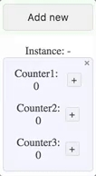
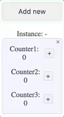
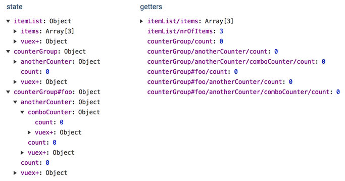

# Example usage of [vuex+](https://github.com/presidenten/vuex-plus)

## Introduction
This demo shows how to use [vuex+](https://github.com/presidenten/vuex-plus) to get instances from [vuex module stores](https://vuex.vuejs.org/en/modules.html) as well as vuex HMR through the  [webpack-context-vuex-hmr](https://github.com/presidenten/webpack-context-vuex-hmr) webpack plugin.

This project is based upon the [vue-cli webpack template](https://github.com/vuejs-templates/webpack), and been modified to show some examples of working with dynamic creation/destruction of component instances with dynamic vuex stores for each instance.

The thought behind the code structure is to keep things that use each other close. Only very light logic goes into vue components, heavy logic goes into vuex models and services.

### Enhancements over Vuex instance handling (2.3.0)+
From Vuex 2.3.0 onward vuex supports the same notation as vue `data` property to [handle instantiation](https://vuex.vuejs.org/en/modules.html).

In most cases this will be enough, but sometimes you need something more. Here is what [vuex+](https://github.com/presidenten/vuex-plus) brings to the table:

Enhancements:
- Instances can be shared across components
- Flag to decide if the state instance should be clared when the last instance component is destroyed
- Generated API for magic strings
- Naming conventions to support automatic HMR out of the box

Limitations:
- Instances populates the vuex store at top level

## Getting started

- Clone this [repo](https://github.com/presidenten/vuex-plus-demo.git)
- Install dependencies by running `yarn`or `npm install`
- Run tests with `npm run test`
- Start the dev server `npm run dev`
- Open http://localhost:8080 and a devtools window with javascript console

## Vuex+ Tutorial
### Basic usage of instances
Components using the Vuex+ `addStore.mixin` gets two registered properties; `instance`and `preserve`.

  - Instance
    Setting `instance` to a unique identifier creates a new instance. Setting `instance` to an existing identifier will use the same instance.
    In this example the first two elements share store instance while the third has its own store instance.
    ```html
    <counterGroup></counterGroup>
    <counterGroup></counterGroup>
    <counterGroup instance="foo"></counterGroup>
    ```
    


  - Preserve
    Set `preserve="true"` to keep the state from beeing discarded when the last instance is removed.


    | false                           | true                            |
    |---------------------------------|---------------------------------|
    |  |  |

### Instances in the main store
Files ending with `-store.js` are considered to be top level stores used in [Vue components](https://vuejs.org/v2/guide/components.html), while files ending with `-substore.js` are considered to be included as modules in top level stores or as modules in substores.

Here is an example of the state with two instance of `counterGroup` - the base instance with no instance parameter and the `foo` instace. In the store they get registered as `counterGroup` and `counterGroup#foo`.


### Generated APIs
Wrapping the vuex module exports in the Vuex+ `{store}` method, the stores become [namespaced](https://vuex.vuejs.org/en/modules.html) and get their own local API with magic strings under `module.api`.
```javascript
import counterGroup from 'counter-group-store.js'
console.log(counterGroup.api);

// =>

  {
    "get": {
      "count": "counterGroup/count"
    },
    "act": {
      "increase": "counterGroup/increase"
    },
    "mutate": {
      "increase": "counterGroup/increase"
    },
    "anotherCounter": {...}
  }
```

When stores are used, they also populate a global api pointing to the base instances of all vuex modules.
```javascript
import { api } from 'vuex+';
console.log(api);

// =>

  {
    "itemList": {
      "get": {...},
      "act": {...},
      "mutate": {...}
    },
    "counterGroup": {
      "get": {
        "count": "counterGroup/count"
      },
      "act": {...},
      "mutate": {...},
      "anotherCounter": {
        "get": {
          "count": "counterGroup/anotherCounter/count"
        },
        "act": {...},
        "mutate": {...},
        "comboCounter": {
          "get": {
            "count": "counterGroup/anotherCounter/comboCounter/count"
          },
          "act": {...},
          "mutate": {...}
        }
      }
    }
  }
```

### Writing module stores
Writing a module store is very similar to writing a normal [vuex module](https://vuex.vuejs.org/en/modules.html), except the file should end with `-store.js`.

This is the general format:
(Check out `./src/components/counter-group/counter-group-store.js` in the repo)
```javascript
// Import store wrapper from vuex+
import { store } from 'vuex+';

// Setup an initial state
const initialState = {
  count: 0,
};

// Write getters in an object as usual
const getters = {
  count: state => state.count,
};

// Write action in an object as usual
const actions = {
  increase(context, amount) {
    // Commit local module mutations with mutation name as string
    context.commit('increase', amount);
  },
};

// Write mutations in an object as usual
const mutations = {
  increase(state, amount) {
    state.count += amount;
  },
};

// Export the vuex module wrapped in the `store` function
// If not using `vuex-plus/loader`, then `name` needs to be added
export default store({
  state: initialState,
  getters,
  actions,
  mutations,
  modules: {
    // submodules, goes here
  }
});
```

### Using module stores

To register a top level store in a component that should be able to be instantiated, there is a [mixin](https://vuejs.org/v2/guide/mixins.html) prepared called `addStore`. `addStore` takes a filename without `.js` to be invoked: `addStore('counter-group-store')`.

Top level stores are a special case, as that they need to use global api when mapping getters and actions through `map.getters` and `map.actions`.

Here is what the script tag should look like in the `.vue`-component:
(Check out `./src/components/counter-group/counter-group.vue` in the repo)
```javascript
<script>
  // Import `use` and the global `api`
  import { map, api, addStore } from 'vuex+';

  export default {
    // Use the addStore mixin to make it instantiable
    mixins: [addStore('counter-group-store')],

    computed: {
      // Use the global api to get the correct magic string
      // for mapGetters/actions. It also handles instances.
      ...map.getters({
        count: api.counterGroup.get.count,
      }),
    },
    methods: {
      ...map.actions({
        increase: api.counterGroup.act.increase,
      }),
    },
    ...
  };
</script>
```

### Writing module substores
Same as with stores, except the file ending should be `-substore.js`.

### Using module substores
Using substores is much more straight forward. Just import `{ map }` from `vuex+` and the store you want to map. The store now contains an api with the magic strings and they will automatically be adjusted for global scopes when passed into `map`'s functions.

Examples can be found in `./src/components/counter-group/another-counter/another-counter.vue` and below.

This is how to set it up:
```javascript
<script>
  import { map } from 'vuex+';
  import anotherCounter from './another-counter-substore.js';

  export default {
    computed: {
      ...map.getters({
        count: anotherCounter.api.get.count,
      }),
    },
    methods: {
      ...map.actions({
        increase: anotherCounter.api.act.increase,
      }),
    },
    ...
  };
</script>
```

### Get/Dispatch/Commit to other parts of the same instance in stores
An extensive example of using Get/Dispatch/Commit from vuex module to/from other module in the same intance can be found in `./src/components/counter-group/another-counter/another-counter-substore.js`.
There are two different ways:
1. When working with a direct child, its easiest to just use the childs api:
```javascript
import comboCounter from './combo-counter/combo-counter-substore.js';

const actions = {
  increase(context, amount) {
    context.dispatch(comboCounter.api.act.increase, 10);
  },
};
```

2. When working with any other module in the instace vuex+ offers an instance property that can be used with global api.
```javascript
import { store, api, instance } from 'vuex+';

const actions = {
  increase(context, amount) {
    instance.get({ path: api.counterGroup.get.count, context })

    instance.dispatch({
      path: api.counterGroup.anotherCounter.comboCounter.act.increase,
      data: 1000,
      context,
    });

    instance.commit({
      path: api.counterGroup.anotherCounter.comboCounter.mutate.increase,
      data: 1000,
      context,
    });
  },
};
```

### Get/Dispatch/Commit from vue component
Example dispatch from vue component to counterGroup instance "":
(See `./src/app.vue` for an example)
```javascript
this.$store.dispatch(api.counterGroup.act.increase);
```

To dispatch to another instance, just replace the instance store name with the instance name. In this case, `counterGroup#foo`:
```javascript
api.counterGroup.act.increase.replace('counterGroup/', 'counterGroup#foo/');
```

### Writing tests
Since the vuex modules dont really know anything about the instance handling, tests are pretty straight forward and isolated.
There is an example on how to test modules in `./components/item-list/item-list-store.spec.js`.
The setup is to create a `state` object and pass in into getters, actions, and mutations, and change `context.commit`and `context.dispatch` to spies and just verify that they are called as planned.

- Testing getters: Inject state and verify outcome

- Testing actions: Inject state and the spied context and verify that the actions dispatches and commits as planned.

- Testing mutations: Inject state and verify changes

### Setup vue/vuex/vuex+/vuex-hmr
In `./src/main.js` the application in almost set up according to the instructions in [webpack-context-vuex-hmr](https://github.com/presidenten/webpack-context-vuex-hmr). Vuex+ is imported and used as a Vue-plugin.
The important thing is that `./app.vue` is loaded _after_ vuex+ has been setup.
```javascript
import Vue from 'vue';
import Vuex from 'vuex';
import VuexPlus from 'vuex+';

Vue.use(Vuex);
Vue.use(VuexPlus);

// Create the Vuex store
const store = new Vuex.Store({
  strict: process.env.NODE_ENV !== 'production',
});

/* eslint-disable */
new Vue({
  el: '#app',
  store,
  render: h => h(require('./app.vue')),
});
```

## Under the hood
Differances from [Vue-cli webpack template](https://github.com/vuejs-templates/webpack) is mainly in `./build/webpack.base.conf.js`:
- Resolve `vuex+` as `vuex-plus`
```javascript
resolve: {
  alias: {
    'vuex+': 'vuex-plus',
  }
},
```
- Use `vuex+` loader to add names to module stores
```javascript
module: {
  rules: [
    {
      test: /-(store|substore)\.js$/,
      loader: 'vuex-plus/loader',
    },
  ],
},
```
- Vuex HMR setup:
```javascript
plugins: [
 new (require('webpack/lib/ContextReplacementPlugin'))(
   /webpack-context-vuex-hmr$/,
   path.resolve(process.cwd(), './src'),
   true,
   /-store.js|-substore.js$/
 )
],
```

- Not using Karma at the moment

# License
MIT
